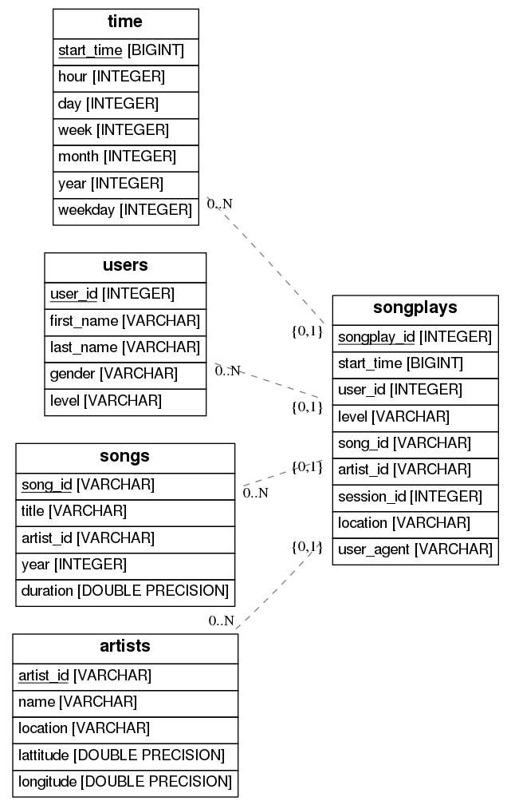

# Data Modeling Project

This is my solution for the first project in the [Data Engineering Nanodegree at Udactiy ](https://eu.udacity.com/course/data-engineer-nanodegree--nd027). The goal was to design a star schema data warehouse and implement ETL processes for a music streaming startup.

## Getting Started

These instructions will get you a copy of the project up and running on your local machine for development and testing purposes. The following steps are tested only for Ubuntu 18.04.

### Prerequisites

All necessary packages are listed in the ```requirements.txt``` file and can be installed by executing:

```
bin/setup
```

This will create a virutal environment ```env``` in your root folder.

## Data Warehousing at Sparkify

Sparkify is a music streaming startup that provides free and premium plans and aims to convert more free users to paid customers. For this purpose, they seek to get to know more about their songs, artists and especially - their customers and their usage patterns.  
Currently, Sparkify is storing the majority of their data in .json files, which is tedious to work with, inefficient when the amount of data grows and prone to data loss. Therefore, they have decided to implement a more sophisticated data warehouse and the corresponding ETL processes.

## Database Schema

The database schema follows the Snowflake style, with one fact table (songplays) and four dimension tables (time, users, songs and artists).



The songplays table has foreign key constraints to all dimensions and well as a composite primary key, made out of all foreign keys.

## ETL Processes

## Examles Queries

## Authors

* **Jan-Benedikt Jagusch** - *Initial work* - [jbj2505](https://github.com/jbj2505)

## License

This project is licensed under the MIT License - see the [LICENSE.md](LICENSE.md) file for details
